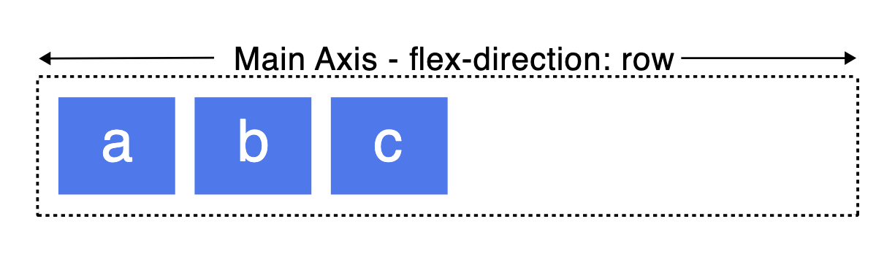
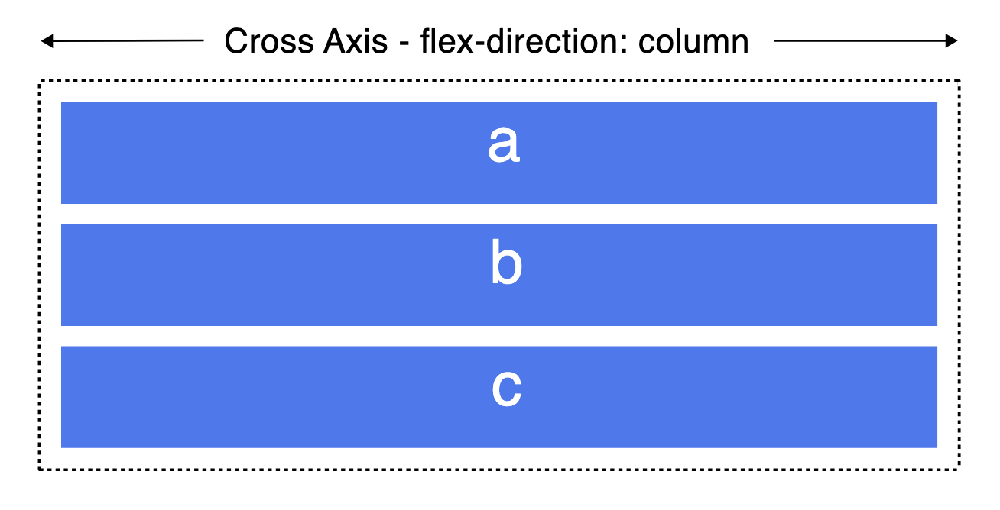

# flexbox
- 아이템 사이의 공간을 정하는데 사용되는 1차원적인 layout model. 다양한 방식으로 배열을 가능케 함.
- flexbox를 1차원적인 layout model이라고 하는 이유는 한번에 row 혹은 column 하나만 바꾸기 때문. 그에 비해 [Grid layout](https://developer.mozilla.org/en-US/docs/Web/CSS/CSS_grid_layout)은 한번에 row, column 두개를 바꾸기에 2차원적인 layout model이라고 표현함.
- Ref: https://developer.mozilla.org/en-US/docs/Web/CSS/CSS_flexible_box_layout/Basic_concepts_of_flexbox

## flexbox 내 두개의 축
- flexbox 내에는 Main axis, Cross axis 두개의 축이 존재함. flex box를 다룰 때는 항상 이 두개의 축 중심으로 생각 해야 함.
- Main axis는 요소들이 정렬되는 축을 의미하고, Cross axis는 Main axis와 수직인 축이다.

### flex-direction
- Main axis를 정하는 키워드

#### row
가로 축을 Main axis로 설정.

#### column
세로 축을 Main axis로 설정.

#### row-reverse
row와 축이 같되, 정렬의 시작을 반대로 설정.

#### column-reverse
column과 축이 같되, 정렬의 시작을 반대로 설정.

## flex container
문서의 영역 중 flexbox를 이용하여 배치된 곳은 flex cotainer라고 부른다. flex container를 만들려면 영역의 `display` 속성을 `flex`로 설정하면 된다.

## justify-content
- flexbox 내 main axis에서 아이템 사이와 주위에 공백을 어떻게 위치 시킬 것인지 결정. 정렬 방식이라고 볼 수 있음. ex. 좌측 정렬, 우측 정렬, 가운데 정렬 etc..
- Ref: https://developer.mozilla.org/en-US/docs/Web/CSS/justify-content
### 종류
- flex-start : container의 main axis 기준하여 시작 정렬
- flex-center : container의 main axis 기준하여 중앙 정렬
- space-between : 요소 사이에 공백을 둠.
- space-around : 요소 양 옆에 같은 크기의 공백을 둠. 맨 우측, 좌측 공백은 아이템 사이의 공백의 절반이됨.
- space-evenly : 요소들 주위에 있는 공백들은 모두 같은 크기임. 맨 우측, 좌측 공백은 아이템 사이의 공백과 크기가 같음.
- etc..

## align-items
- flexbox 내 cross axis에서 아이템들의 정렬 방식을 결정.
- Ref: https://developer.mozilla.org/en-US/docs/Web/CSS/align-items
### 종류
- stretch : cross axis를 전부 채움.
- center : 중앙 정렬.
- start : 시작 정렬.
- end : 끝 정렬.

## flex-*
### flex-grow
- flex container 내부의 남은 공간 중에 flex item(자식 요소)이 할당 받을 수 있는 공간의 비율을 나타냄.
- flex container에 `display: flex`를 설정하면 flex item의 content가 차지하고 남은 공간들이 생김. flex-grow를 이용하여 각 flex item들이 어떻게 나눠가질지 결정할 수 있음.
### flex-basis
- flex item이 기본적으로 차지하려는 크기.
- flex container 안의 남는 공간을 flex item들에 나눠주기 전에 각 flex item들이 차지하는 크기. 
### flex-shrink
- flex container 안의 공간이 부족할 때 flex item이 줄어드는 비율.
- 기본 값은 1임. 즉 줄어들 수 있다는 뜻. 2가 된다면 줄어들어야 하는 상황에 0.5배 크기로 줄어듦.