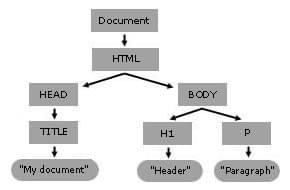

# DOM script
### DOM이란
Document Object Model은 web document와 상호작용할 수 있는 인터페이스다. DOM은 웹페이지의 html 혹은 xml 구조를 메모리에 저장하고 있는 구조다. 스크립트 혹은 프로그래밍 언어는 DOM을 이용하여 웹페이지의 요소들과 상호작용(조회, 조작 등) 할 수 있다.

아래의 html은
```
<html lang="en">
  <head>
    <title>My Document</title>
  </head>
  <body>
    <h1>Header</h1>
    <p>Paragraph</p>
  </body>
</html>
```

이러한 dom-tree를 가진다. 웹 브라우저는 html을 파싱하여 DOM을 만들고, DOM을 이용하여 랜더링을 한다.

#### Ref
- https://developer.mozilla.org/en-US/docs/Web/API/Document_Object_Model/Using_the_Document_Object_Model#what_is_a_dom_tree
- https://developer.mozilla.org/en-US/docs/Web/Performance/Guides/How_browsers_work#parsing

### Document란
- Document 인터페이스는 브라우저에 로딩된 웹 페이지를 나타낸다. Document 인터페이스를 이용하여 DOM과 같은 웹 페이지 content에 접근할 수 있다.
- ex. `document.querySelector`

### Document: querySelector method
- css selector의 패턴과 일치하는 첫번째 Element를 리턴함.
- usage: document.querySelector(css selector)

### document.querySelectorAll
- css selector의 패턴과 일치하는 Element들로 구성된 전역적인 NodeList를 리턴함.
- usage: document.querySelectorAll(css selector)

### css selector란
- 특정 css 규칙들을 따르는 요소들을 선택하기 위한 패턴을 정의한 것.
- ex. class-selector: `.class-name`, id-selector: `#id`

### Data attribute
- HTML의 특정 요소에 custom attribute를 설정하고 싶을 떄 사용하는 표준 스펙.
- HTML과 DOM 사이에서 개별 요소들의 값을 script를 이용하여 주고 받고 싶을 때 사용함. 즉, HTML 내 특정 요소와 관련된 데이터이지만 시각화할 필요는 없을 때 Data attribute를 이용함.
- element.getAttribute를 사용할 수도 있고, dataset 속성을 활용할 수도 있음. dataset은 custom data attribute(`data-*`)에 접근 할 수 있는 map of strings(`DOMStringMap`)임. 이를 이용하여 각각의 `data-*` 속성에 접근할 수 있음. 
아래와 같은 html이 있을 때,
```
<main>
  <article
    id="electronic-cars"
    data-columns="3"
    data-index-number="12345"
    >
  </article>

  <article
    id="solar-cars"
    data-columns="3"
    data-index-number="12346"
    >
  </article>
</main>
```

다음 코드는 "3"과 "12345"를 출력한다.
```
const article = document.querySelector("#electronic-cars");

// dataset을 이용
console.log(article.dataset.columns);
console.log(article.dataset.indexNumber);

// getAttribute(..) 메소드 활용
console.log(article.getAttribute('data-columns'));
console.log(article.getAttribute('data-index-number'));
```