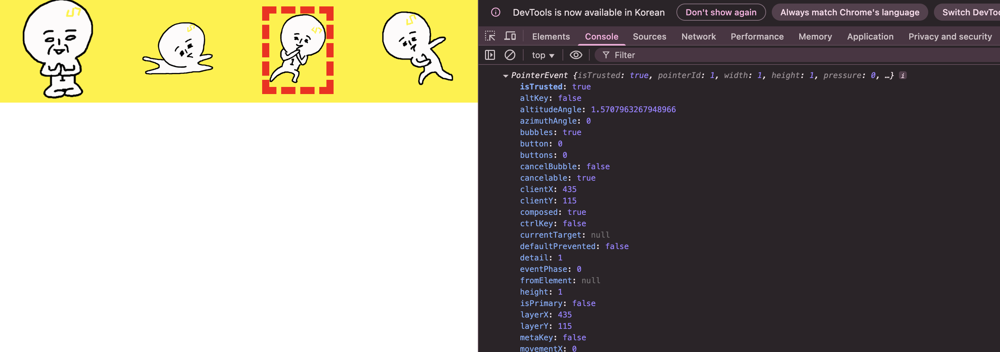

# javascript event

## Window
`Window` 인터페이스는 DOM 문서를 포함하고 있는 window를 나타낸다. 전역 변수인 `window`는 자바스크립트 코드에서 접근할 수 있다.

## EventTarget
- `EventTarget`는 이벤트를 수신할 수 있거나, 자신으로 부터 이벤트를 들으려고 하는 객체들이 구현한다.
- ref: https://developer.mozilla.org/en-US/docs/Web/API/EventTarget/addEventListener

### 메소드 종류
- EventTarget.addEventListener();
- EventTarget.removeEventListener();
- EventTarget.dispatchEvent();

## HTML 문서 생명주기 관련 주요 이벤트
https://ko.javascript.info/onload-ondomcontentloaded

### `DOMContentLoaded`
- 브라우저가 HTML 문서를 다 읽고 DOM 트리를 완성하는 즉시 발생. 이미지 파일 및 스크립트 등 기타 지원은 기다리지 않음.
- DOM 요소를 접근해야 하지만 이미지 파일 등은 기다릴 필요 없을 떄 사용.
### `load`
- 브라우저가 모든 로딩 과정을 끝났을 때 발생. 이미지가 로딩되고 스크립트 파일도 모두 실행 됨.
- 이미지 파일 크기 등을 이용하여 로직을 실행 해야 할 경우에 사용.
### `beforeunload`/`unload`
- 사용자가 페이지를 떠날 때 발생.
- 사용자가 떠나기 전 미리 저장 알람을 하거나 방문 통계 등을 계산할 때 사용.

## defer & async
https://ko.javascript.info/script-async-defer
브라우저는 html을 읽다가`<script>`를 만나면 `src`를 다운 받고 실행 해야 하므로 멈춤. 이 시간이 길면 페이지 로딩이 느려짐. defer과 async는 스크립트 다운을 백그라운드에서 실행하고 실행을 뒤로 미룰 수 있게 함. 즉 스크립트를 다운로드 하는 동안 html 파싱이 멈추지 않음. 

```
<html>
<head>
  ..스크립트 앞 컨텐츠
  <script src="https://content.....">
  </script>
</head>
<body>
  ...스크립트 뒤 컨텐츠
</body>
</html>
```

### defer
- `defer`를 사용하면 `src`를 백그라운드에서 다운로드 함. 그리고 DOM 생성이 끝난 후 `DOMContentedLoaded` 이벤트가 발행되기 직전에 스크립트를 실행.
- 비동기로 스크립트를 다운 받고, 해당 스크립트가 이 페이지의 DOM 요소와 관련 있을 경우 `defer`를 사용함.

### async
- async가 붙은 스크립트는 페이지와 완전 독립적으로 동작함. 스크립트를 비동기적으로 다운 받은 후 HTML 페이지가 다 파싱 되기 전이라도 스크립트를 실행 함.
- 페이지의 DOM과 관련되지 않은 코드를 실행할 때(ex. stats.js) 사용함.
- async 스크립트를 다운 받을 때는 HTML 파싱을 방해하진 않지만, 실행할 때는 HTML 파싱이 멈춤. 다만 스크립트 실행 시간이 짧고, 브라우저 랜더링은 동시에 진행되기에 문제 없음

## Event
https://developer.mozilla.org/ko/docs/Web/API/Event
- `Event` 인터페이스는 DOM에서 발생한 이벤트를 나타냄. 하드웨어를 이용한 동작(ex. MouseEvent)으로 인한 이벤트가 기본적으로 제공되고, 비즈니스 로직을 처리하기 위한 이벤트도 포함한다.
- 이벤트들은 `addEventListener`를 통해 특정 이벤트를 subscribe 할 수 있고, `dispatchEvent`를 이용하여 이벤트를 발행할 수도 있다.

아래와 같은 스크립트를 실행 시
```
<script>
{
    const ilbuni = document.querySelector('.ilbuni.c');

    function clickIlbuniHanlder(e) {
        ilbuni.classList.toggle('special');
        console.log(e);
    }

    ilbuni.addEventListener('click', clickIlbuniHanlder);
}
</script>
```

Pointer event를 얻을 수 있다.
https://developer.mozilla.org/ko/docs/Web/API/PointerEvent



Pointer 이벤트는 아래와 같은 상속 구조를 가지고 있다.
- Event <-- UIEvent <-- MouseEvent <-- PointerEvent
